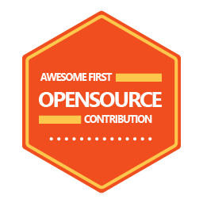

# cse-badges

A collection of badges used for CSE team recognition. :eyes:

## Examples

## How to contribute

1) You'll want to use a tool like Illustrator
2) Open `Badges\*\*.ai`
3) Edit
4) Export a new `example.png`
5) (optional) update [`examples.svg`](,/examples.svg) if you think that's needed
5) (optional) update [`examples.png`](,/examples.png) if you think that's needed